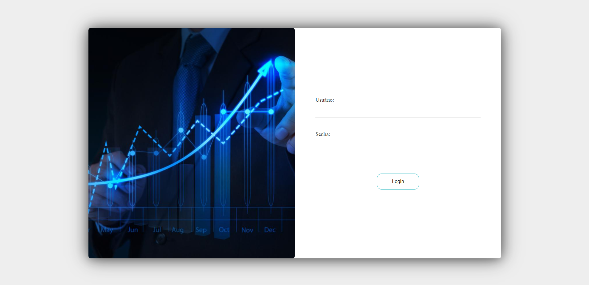
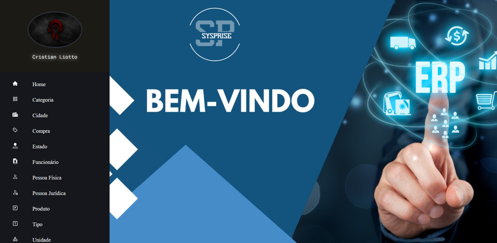
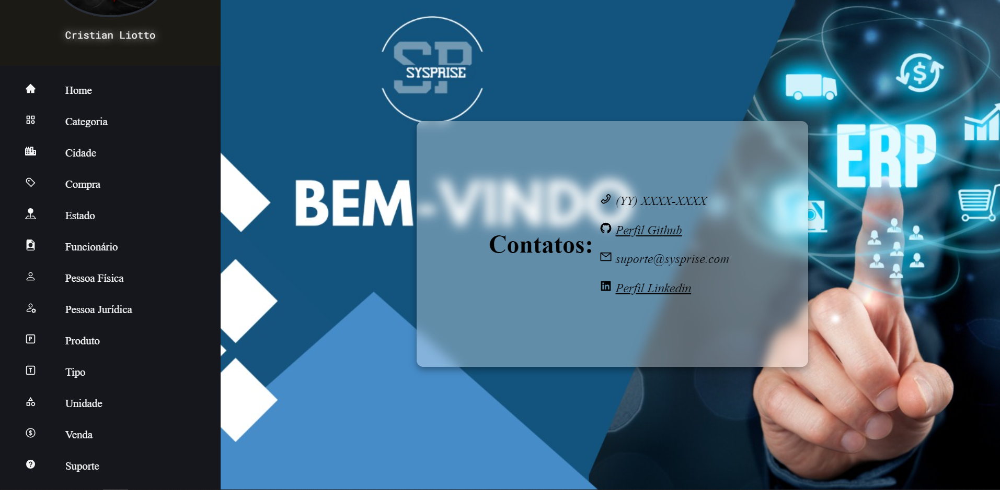
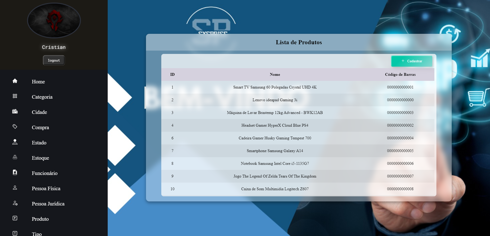
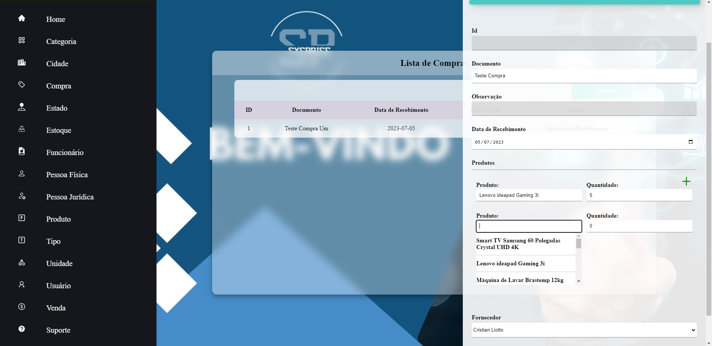

<h1 align="center"> Sysprise </h1>

    

## Índice

* [Descrição do Projeto](#descrição-do-projeto)
* [Status do Projeto](#status-do-Projeto)
* [Funcionalidades e Demonstração da Aplicação](#funcionalidades-e-demonstração-da-aplicação)
* [Tecnologias utilizadas](#tecnologias-utilizadas)
* [Licença](#licença)

## Descrição do Projeto

Esta é uma das partes em desenvolvimento de um projeto que tem o objetivo de fornecer ao usuário uma interface simples e intuitiva de um sistema ERP, sendo construída com base no framework ReactJS.

## Status do Projeto

:construction: Projeto em construção :construction:

## Funcionalidades e Demonstração da Aplicação

Atualmente o sistema possibilita o CRUD de pessoa física e jurídica, produto, funcionário, usuário, cidade, tipo de pessoa, cidade, estado, endereço, contatos, unidade, venda e compra.

### Tela de Login

### Tela de Inicial

### Tela de Suporte

### Tela de Produtos

### Tela de Cadastro de Compra de Material

## Tecnologias utilizadas

- ``React``
- ``Recoil``
- ``ESLint``
- ``VSCode``
- ``Typescript``
- ``React-Icons``
- ``React-Spinner``

## Licença

GNU GENERAL PUBLIC LICENSE v3